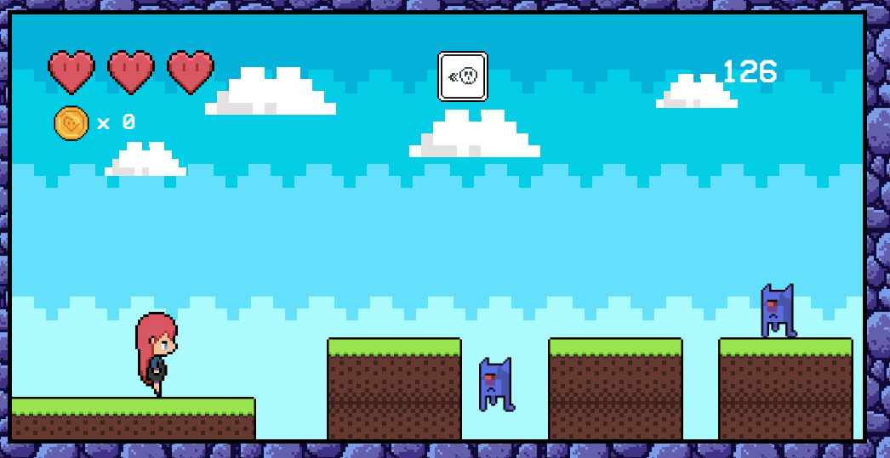
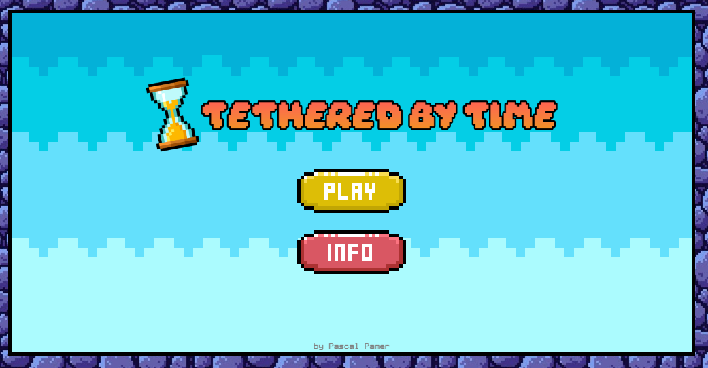
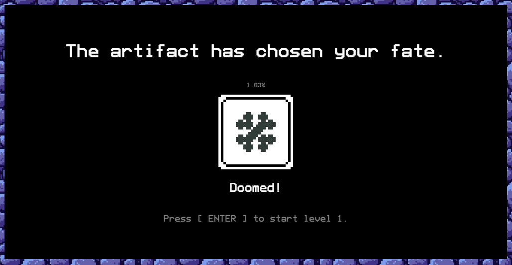
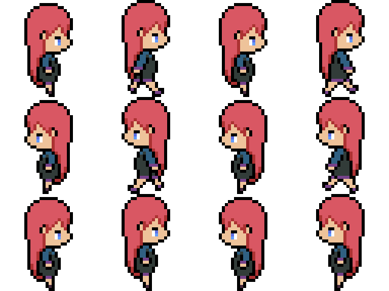
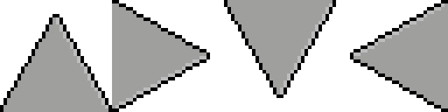
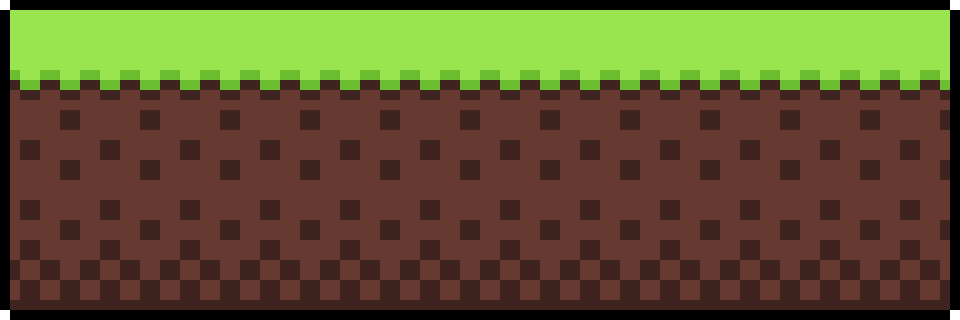
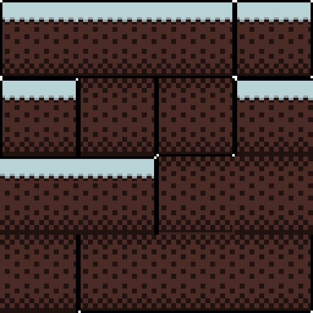
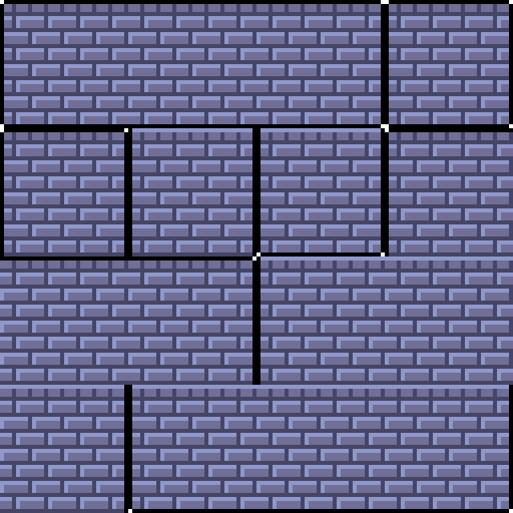
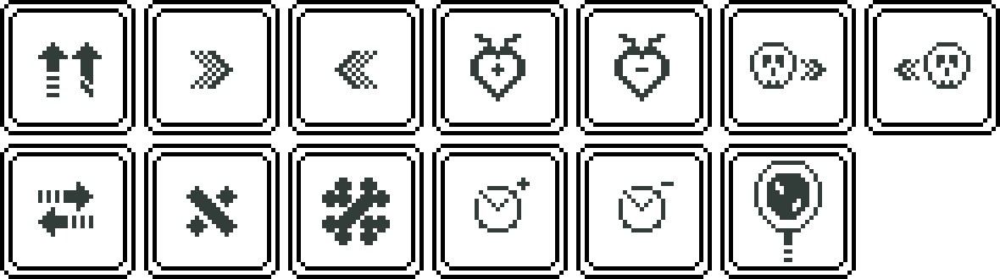

# 🎮 **Tethered by Time** 

> **Short Pitch**: Tethered by Time is a platformer game set in a world where time is constantly shifting. Players must navigate through challenging levels, each altered by unpredictable modifiers, while keeping an eye on health and their remaining time.

---

## 🌐 **Play the Game**
Unfortunately, GitHub Pages can't host my game because it has problems showing the images for my game.
You have to download and run the game locally in order to play it.
---

## 📸 **Screenshots**

### Main Gameplay:

  
  
Figure 1: Gameplay Screenshot

---

### Menu and UI:

  
  
Figure 2: Title Screen

  
  
Figure 3: Generated Modifier Menu

---

## 🎨 **Spritesheets**
Below are the sprites used to create characters and objects in the game:

### Player Character:

  
  
Figure 4: Player character animations.

---

### Enemies:

  
  
Figure 5: Ghost animations.

  
  
Figure 6: Spike spritesheet.

### Objects:

  
  
Figure 7: Coin animations.

  
  
Figure 8: Star animations.

### Platforms:

  
  
Figure 9: Tiles for grass

  
  
Figure 10: Tiles for dark grass

  
  
Figure 11: Tiles for stone

  
  
Figure 12: Tiles for wood

### Modifiers:

    
    
Figure 13: All images for the modifiers

---

## ✍️ **Reflection**

### What went well:
- **Designing the game:** I loved to create the sprites, even though I'm not really good at drawing. It was a surprise to me that the pixel art looks really good!
- **Refactoring the code:** I refactored the code at the end of the code lab so that every feature was in it's own file and some redundancies were removed.

### Challenges:
- **Bug Fixes:** The scrolling mechanic was very bugged at the beginning and it took me 3 days to fully fix it but now everything is working fine!
- **Readjusting the variables:** I had to fine-tune the variables for the modifiers and then also finetune the levels based on the modifiers so that the player can beat the level with any modifiers applied.

### Lessons Learned:
- **Creating the gameplay first:** I tried to create some pixel art for the game before even working on the code and I had many problems implementing this pixel art into the game so I had to redo some of it after I've written the overall code for the game.